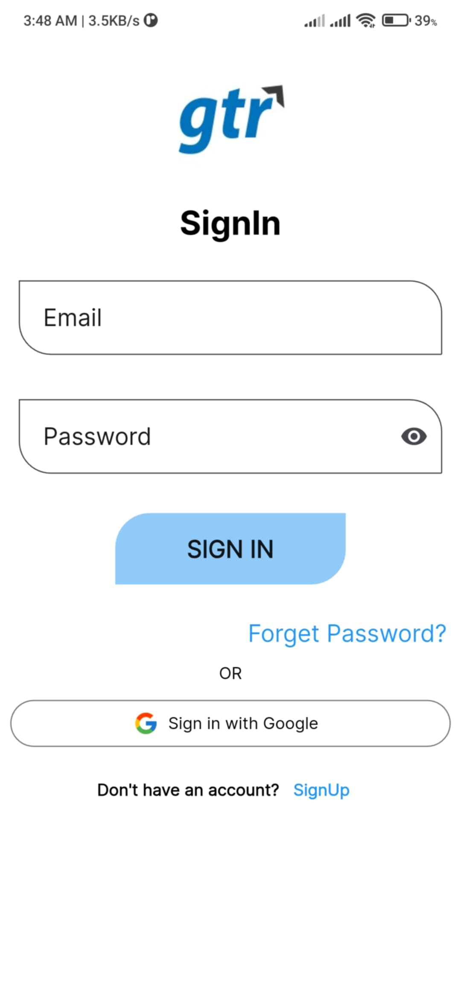
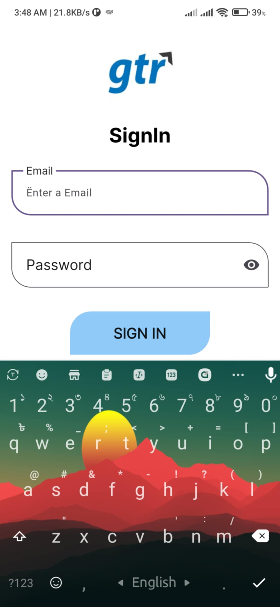
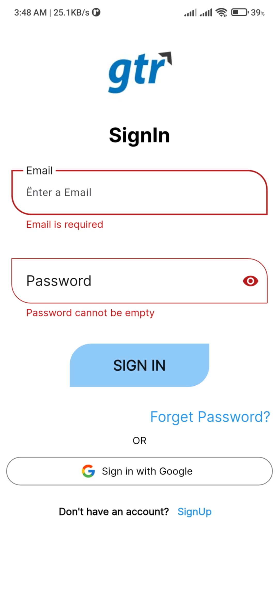
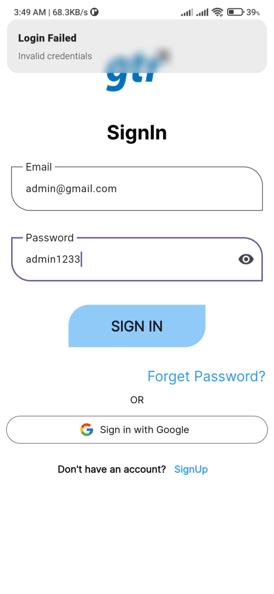
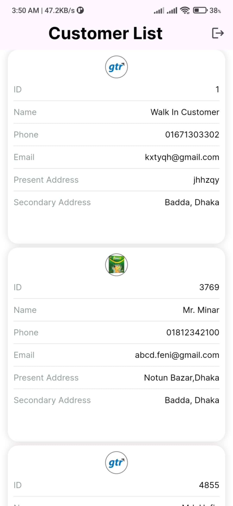

## 📱 GTR Task - Customer Viewer App

A Flutter mobile application built using **GetX** for state management and **MVVM architecture**, designed to fetch and display customer data from an API with proper pagination and type-safe model handling.

---

## 🚀 Features

- ✅ Fetch customer list from remote API
- ✅ Paginated customer loading (infinite scroll-ready)
- ✅ Custom model parsing with safe `int`/`double` casting
- ✅ UI built using reusable widgets
- ✅ GetX controller lifecycle and reactive state updates
- ✅ Defensive error handling with loading state
- ✅ Designed with `flutter_screenutil` for responsiveness

---

## 🛠️ Tech Stack

| Layer        | Technology               |
|--------------|---------------------------|
| State Mgmt   | [GetX](https://pub.dev/packages/get) |
| UI Toolkit   | Flutter + ScreenUtil      |
| Data Layer   | Custom API Services       |
| Local Cache  | GetStorage (optional)     |
| Architecture | MVVM with Controller & Service Layers |

---

| Customer List ScreenShot                  |
| ---------------------------------------------------|       
|  |
|  |
|  |
|  
| | 
|  |

## 🙋 Author

Saklain Mostak|
Flutter Developer|
📧 Email: saklain.pub@gmail.com|
🌐 phone: 01518989122|
